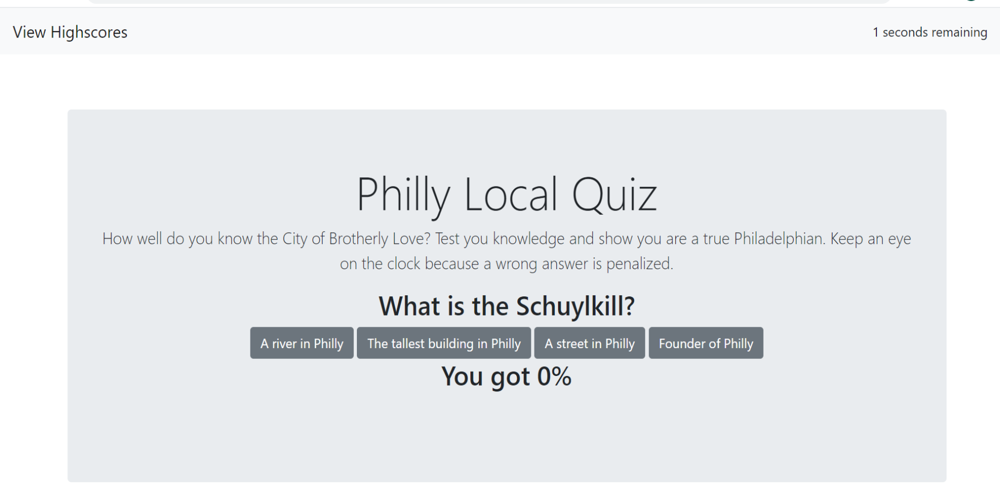

# Homework 4 - Code Quiz App
The task is to build a timed code quiz with multiple-choice questions. This app will run in the browser and feature dynamically updated HTML and CSS powered by your JavaScript code. It will also feature a clean and polished user interface and be responsive, ensuring that it adapts to multiple screen sizes.

# How it is Made

This web application uses html, css, bootstrap, and dynamic javascript to render a web based multiple choice quiz.  The user is asked to answer 5 multiple choice questions which are then scored out of 100%. User will have 90 seconds to answer all five questions and the first wrong answer is penaized 10 seconds and the second wrong answer is penalized by 20 seconds. 

# Web Application Components

A html file containing the basic skeleton was used along with custom css and a separate javaScript file. Some boostrap components are used to style buttons and other parts of the application.

# Screenshot


#Other details
git clone git@github.com/wayele/codequiz


```

## Technologies Used

* Html
* CSS/Bootstrap
* JavaScript

## Author

- Wub


